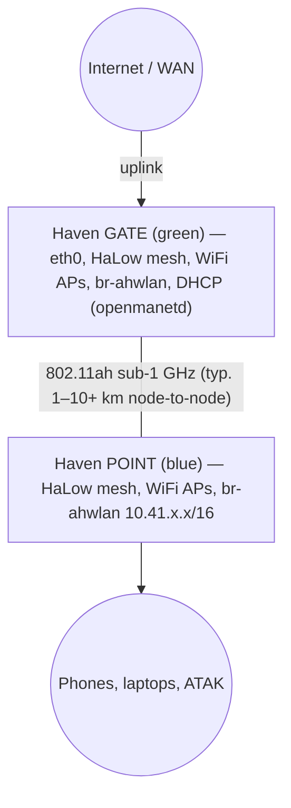

# Haven MANET IP Mesh Radio

Build decentralized, long-range mesh networks with **Haven** — a complete open-source solution for creating self-healing IP networks that share internet access across kilometers without any central infrastructure.

> [!TIP]
> **Get on the air:** flash [OpenMANET](https://openmanet.org/), then the **[setup guide](docs/getting-started/setup-guide.md)**. **Find a node:** **[Finding & accessing nodes](docs/reference/finding-nodes.md)**. **Print a case** (100% free): **[Enclosures](#enclosures)** or [Haven case on Printables](https://www.printables.com/model/1468595-haven-case-for-raspberry-pi-based-manet-by-paralle). **Build help & community:** [Haven Guide](https://buildwithparallel.com/products/haven) (videos, schematics, Discord, support).

## What is Haven?

Haven is a mesh networking platform that combines:

- **HaLow radios** (802.11ah) operating in sub-1GHz spectrum for multi-kilometer range
- **BATMAN-adv** for automatic Layer 2 mesh routing
- **OpenMANET** firmware (OpenWrt-based) for reliable embedded networking
- **Optional Reticulum** for encrypted overlay communications
- **Optional ATAK/CivTAK** integration for situational awareness

### Why Haven?

| Feature | Benefit |
|---------|---------|
| **Decentralized** | No central server, no single point of failure |
| **Long Range** | 1-10+ km node-to-node with HaLow radios |
| **Self-Healing** | Automatic route discovery and failover |
| **Internet Sharing** | One uplink serves the entire mesh |
| **Fully Open Source** | No proprietary lock-in, audit everything |
| **Multi-hop** | Traffic routes through intermediate nodes |
| **Low Power** | Sub-1GHz radios are power efficient |

## Haven Nodes

Haven nodes are compact, rugged units built for field deployment. Each node includes HaLow (sub-1GHz) and WiFi radios, USB and power ports, and versatile mounting (GoPro-style bracket and bolt holes).

| | | |
|:---:|:---:|:---:|
|  |  |  |
| Handheld | Vehicle deployment | Ports and mounting |

## Enclosures

The official [Haven case for Raspberry Pi–based MANET](https://www.printables.com/model/1468595-haven-case-for-raspberry-pi-based-manet-by-paralle) on [Printables](https://www.printables.com/) is **100% free** — **public domain**: no cost to download, and you may print, modify, and share without restriction. Enclosure design: [MOROSX](https://morosx.com/).

- **[Download the Haven case (Printables)](https://www.printables.com/model/1468595-haven-case-for-raspberry-pi-based-manet-by-paralle)** — STLs and part notes are on that page
- The [Haven Guide](https://buildwithparallel.com/products/haven) also places the case in the full build (radios, power, mounting, etc.)

## Network Architecture

## Documentation

| Document | What it covers |
|----------|----------------|
| **[Docs home (sitemap)](docs/README.md)** | Where everything lives: getting started, reference, runbooks, advanced |
| **[Enclosures](#enclosures)** (this page) | 100% free public-domain **3D case** for Pi-based nodes ([Printables](https://www.printables.com/model/1468595-haven-case-for-raspberry-pi-based-manet-by-paralle)) |
| **[Setup Guide](docs/getting-started/setup-guide.md)** | Step-by-step: gate setup, point nodes, Reticulum, ATAK, Heltec nodes |
| **[Finding & Accessing Nodes](docs/reference/finding-nodes.md)** | How to find node IPs and reach LuCI — the thing you'll need most often |
| **[Troubleshooting](docs/runbooks/troubleshooting.md)** | Mental model, diagnostics, fix checklists for every common failure |
| **[HaLow Reference](docs/reference/halow-reference.md)** | Radio specs, channel widths, MCS tables, software versions |
| **[Range Optimization](docs/advanced/range-optimization.md)** | Antenna selection, TX power, channel width tuning, range testing |
| **[Antenna Smart Routing](docs/advanced/antenna-smart-routing.md)** | Automatic antenna switching with RF SPDT switch |
| **[Gate Node Config](docs/reference/haven-gate.md)** | Manual gate configuration reference |
| **[Point Node Config](docs/reference/haven-point.md)** | Manual point configuration reference |
| **[Reticulum](integrations/reticulum/README.md)** | Encrypted overlay network — configuration, monitoring, apps |
| **[ATAK Bridge](integrations/atak/README.md)** | ATAK/CivTAK situational awareness over Reticulum |
| **[Scripts](scripts/README.md)** | Script reference and Reticulum demo tools |
| **[AI Agents](AGENTS.md)** | Context for AI agents (Claude, Cursor, etc.) to diagnose and fix your mesh |

## Quick Start

All Haven setup scripts assume each node is flashed with a fresh/recent version of [OpenMANET](https://openmanet.org/). Flash the image onto a microSD card using Raspberry Pi Imager, insert it into the node, and power on. If the card still looks like it has old data after flashing, use Raspberry Pi Imager’s **Erase** (or SD **format/erase** utility) on the card first, then write the image. On **Raspberry Pi 4**, writing **Raspberry Pi OS (vanilla)** to the card once, then **OpenMANET on top**, can unstick a stubborn card; see the [setup guide](docs/getting-started/setup-guide.md) (same section as Erase / SD tips).

| Step | What | How |
|------|------|-----|
| **1** | Set up the Gate node | Plug into router, run setup script → [Setup Guide](docs/getting-started/setup-guide.md#step-1-set-up-the-gate-node-green) |
| **2** | Add Point nodes | Plug into laptop, paste setup script → [Setup Guide](docs/getting-started/setup-guide.md#step-2-add-point-nodes-blue) |
| **3** | Install Reticulum *(optional)* | Encrypted overlay → [Setup Guide](docs/getting-started/setup-guide.md#step-3-install-reticulum-optional) |
| **4** | Send Reticulum messages *(optional)* | Test encrypted messaging → [Scripts](scripts/README.md#reticulum-demo-scripts) |
| **5** | Install the ATAK bridge *(optional)* | Situational awareness → [Setup Guide](docs/getting-started/setup-guide.md#step-5-install-the-atak-bridge-optional) |

> After any step, use LuCI's web interface to change passwords, WiFi SSIDs, and other settings. See **[Finding & Accessing Nodes](docs/reference/finding-nodes.md)** to reach each node.

> [!CAUTION]
> The defaults below are for first boot only. **Change the root password and WiFi credentials** in LuCI before you rely on this in the field.

<strong>Default <code>root</code> credentials and WiFi (first boot)</strong>

| Node | Password | WiFi SSID | WiFi Password |
|------|----------|-----------|---------------|
| Gate (green) | `havengreen` | `green-5ghz` | `green-5ghz` |
| Gate (green) 2.4GHz | — | `green` | `greengreen` |
| Point (blue) | `havenblue` | `blue-2g` (2.4GHz USB; from `setup-haven-point.sh`) | `blue-2g` |

## Hardware Requirements

### Tested Platform
- **SBC**: Raspberry Pi CM4 / Pi 4
- **HaLow Radio**: Morse Micro MM601X (SPI interface)
- **5GHz WiFi**: Cypress CYW43455 (onboard on Pi)
- **2.4GHz WiFi**: RT5370 USB adapter (optional)

### Minimum Requirements
- ARM or x86 device with SPI interface
- HaLow radio module (Morse Micro recommended)
- Standard WiFi for client access

## Use Cases

- **Disaster Response**: Deploy mesh networks where infrastructure is damaged
- **Remote Operations**: Connect sites across kilometers without internet
- **Events**: Temporary networks for large gatherings
- **Maritime**: Ship-to-ship and ship-to-shore communications
- **Agriculture**: Connect sensors and equipment across large properties
- **Community Networks**: Neighborhood internet sharing

## Security

| Layer | Protection |
|-------|------------|
| HaLow Mesh | WPA3 SAE (CCMP) - strongest WiFi encryption |
| Reticulum | Curve25519 + AES-128 end-to-end encryption |
| ATAK | Optional additional encryption |

## Support & Community

- **[Haven Guide](https://buildwithparallel.com/products/haven)** - Complete build guide with videos
- **Discord** - Join the community (link in Haven Guide)
- **Direct Support** - Available through Parallel

## Contributing

Contributions welcome. Examples:

- [ ] Hardware compatibility testing
- [ ] Documentation improvements
- [ ] Bug fixes and features
- [ ] New use case write-ups

## License

MIT License - See [LICENSE](LICENSE) file.

## Acknowledgments

- [OpenMANET](https://openmanet.org/) - Mesh networking firmware
- [Reticulum](https://reticulum.network/) by Mark Qvist
- [ATAK](https://tak.gov/) by TAK Product Center
- [Morse Micro](https://www.morsemicro.com/) - HaLow radio technology
- [OpenWrt](https://openwrt.org/) Project
- [MOROSX](https://morosx.com/) - Haven enclosure design
- [BATMAN-adv](https://www.open-mesh.org/) mesh protocol
