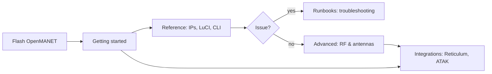

# Haven documentation

> [!NOTE]
> Optional overlays (**Reticulum**, **ATAK/CoT**) are documented under **[`integrations/`](../integrations/)** in this repo. **3D case (100% free, public domain):** see **[Enclosures](../README.md#enclosures)** in the main readme.

### How the docs fit together

| I want to… | Start here |
|------------|------------|
| **Flash OpenMANET and set up a mesh (gate + points)** | [Getting started](getting-started/README.md) — main walkthrough: [setup guide](getting-started/setup-guide.md) |
| **Find a node’s IP, LuCI, SSH** | [Reference — Finding & accessing nodes](reference/finding-nodes.md) |
| **Look up radio / node settings** | [Reference](reference/) — [HaLow](reference/halow-reference.md), [gate](reference/haven-gate.md), [point](reference/haven-point.md) |
| **Fix a problem** | [Runbooks — Troubleshooting](runbooks/troubleshooting.md) |
| **Tune range, antennas, RF** | [Advanced](advanced/) — [range](advanced/range-optimization.md), [antenna smart routing](advanced/antenna-smart-routing.md) |
| **Reticulum (optional overlay)** | [integrations/reticulum/](../integrations/reticulum/README.md) |
| **ATAK / CoT (optional)** | [integrations/atak/](../integrations/atak/README.md) |

Firmware (OpenMANET) is not built in this repo — see [openmanet.org](https://openmanet.org/) and the [OpenMANET/firmware](https://github.com/OpenMANET/firmware) project.

Shell scripts for nodes live under [`scripts/`](../scripts/README.md) (`node-setup/`, `node-ops/`, `optional/`, `tools/`).
