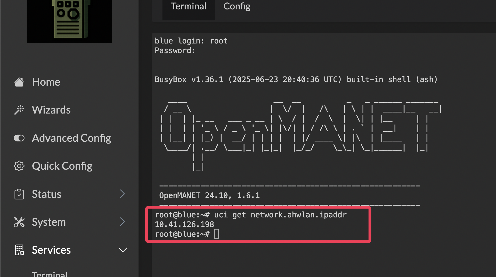
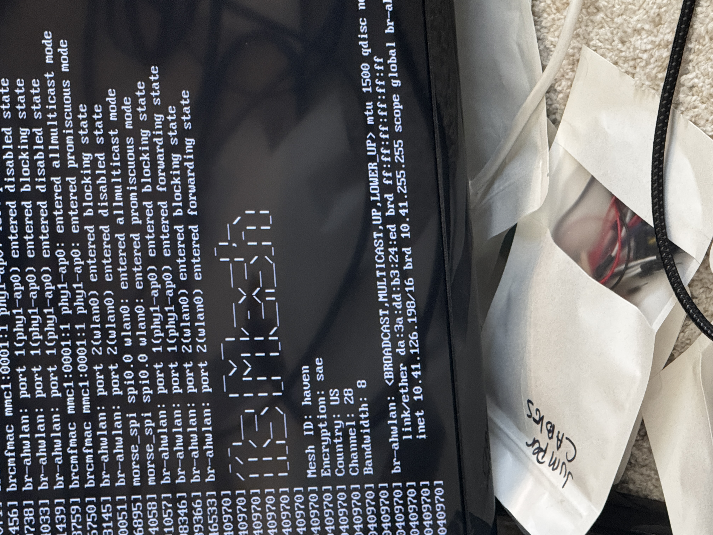
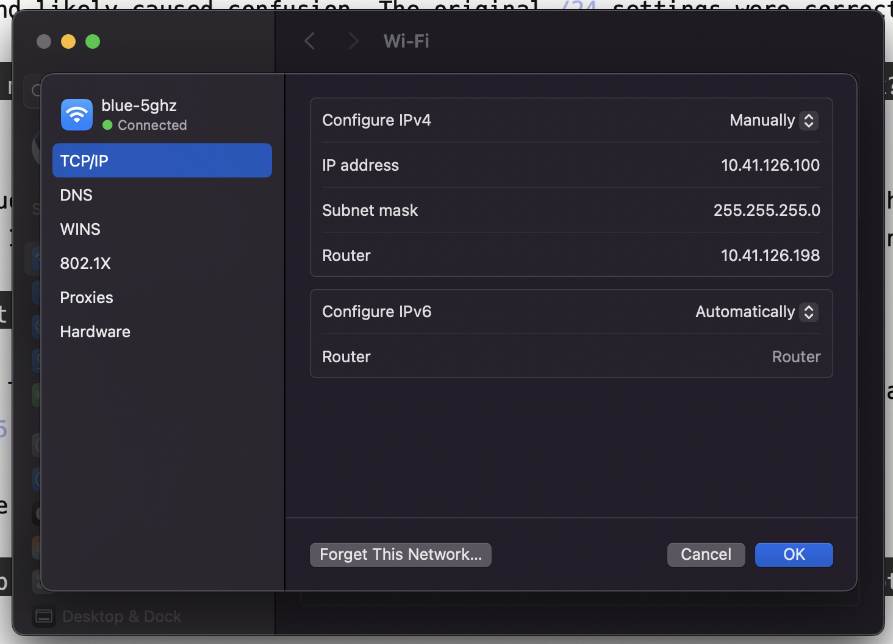

# Finding & Accessing Nodes

After setup, you need to find each node's IP to access its web interface (LuCI) or SSH in. This is the most common task on the mesh — especially for point nodes connected via BATMAN-adv, which don't have predictable IPs.

**Default credentials** (user: `root`):

| Node | Password |
|------|----------|
| Gate (green) | `havengreen` |
| Point (blue) | `havenblue` |
| Heltec | `heltec.org` |

---

## The Core Principle: Any Node, From Anywhere on the Mesh

**Every LuCI and SSH endpoint is reachable from every other point on the mesh.** That's the point of the mesh — there is no "blue's network" vs "green's network." Every node bridges its WiFi AP into `br-ahwlan`, BATMAN-adv stitches the bridges together over HaLow, and every client and node lives on the same flat `10.41.0.0/16` subnet.

What this means in practice:

- Joined `green-5ghz`? You can reach `http://<blue-ip>`, `http://<heltec-ip>`, and any other node's LuCI.
- Joined `blue-5ghz`? Same — reach green, heltec, or any point node.
- SSH'd into any node? `ssh root@<any-other-node-ip>` works directly.
- Phones on different nodes' WiFi APs can ping each other, Reticulum peers auto-discover, etc.

Caveats:

- **Ping the target first** on the very first reach — BATMAN-adv's Distributed ARP Table needs a beat to resolve (see the Quick Answer callout below). This is the #1 "mesh looks broken" moment.
- **The mesh has to be healthy** — `bat0` in `br-ahwlan`, `wlan0` inside `bat0`, on every node. See [Troubleshooting](troubleshooting.md).
- **Heltec's standalone 2.4GHz AP on `10.42.0.0/24`** is the fallback AP that **bypasses** the mesh. Clients there are isolated. After `configure-heltec.sh`, the Heltec joins the mesh and its AP lands on `10.41.x.x` with everyone else.
- **Coming from your home LAN** (e.g. your laptop on your regular home WiFi) you can only reach the gate directly. To reach other nodes, hop through the gate — SSH `ProxyCommand` or a port-forward (see Method 5).

---

## Quick Answer: "I'm on green's WiFi, how do I reach blue's LuCI?"

1. SSH into the gate: `ssh root@<gate-ip>`
2. Find blue's IP: `strings /etc/openmanetd/openmanetd.db`
3. **Ping blue from your laptop first:** `ping <blue-ip>` — wait for replies, then hit Ctrl-C
4. Open `http://<blue-ip>` in your browser (while still on green's WiFi)

This works because the gate bridges WiFi clients onto the same mesh subnet. Your laptop on green's WiFi can reach any `10.41.x.x` address directly.

> **Always ping before you browse.** BATMAN-adv uses a Distributed ARP Table (DAT) instead of broadcasting ARP across the mesh. The first time your laptop talks to a node it has never seen, ARP resolution takes a beat over HaLow — long enough that a browser or SSH connection usually times out before it finishes. A quick `ping` kicks off resolution; once the MAC is cached, everything else (LuCI, SSH) is instant. Skipping this step is the #1 reason "the mesh looks broken" right after setup.

### If `http://<blue-ip>` doesn't load

The `openmanetd.db` entry can be stale (an IP from a previous boot) or blue may not be fully on the mesh. Work through these in order:

```bash
# On the gate — verify blue is actually at that IP right now
ping -c 3 <blue-ip>

# No reply? Find blue's current IP a different way:
batctl n                             # HaLow neighbors (MAC addresses)
ip neigh show dev br-ahwlan | grep 10.41   # live ARP table — real current IPs
```

Cross-reference blue's MAC from `batctl n` against `ip neigh` to find its current IP, then try `http://<real-ip>` in the browser.

Still failing? Check from your **laptop** (while on `green-5ghz`):

- Confirm you got a `10.41.x.x` address (not a `192.168.x.x` home-WiFi IP — easy to mix up)
- Make sure `ping <blue-ip>` actually returns replies (see the callout in the Quick Answer above — always ping before you browse)
- Make sure you're using `http://`, not `https://` — LuCI is HTTP only

If ping fails from the gate itself, the problem is the mesh — run the diagnostic script on blue (see [Troubleshooting](troubleshooting.md)).

---

## Method 1: Run a command on the node

If you can reach the node's web interface or SSH into it, run this command to print its mesh IP:
```bash
uci get network.ahwlan.ipaddr
```

Two ways to get a terminal on the node:
- **SSH from your computer:** `ssh root@<node-ip>` (use the node's password)
- **LuCI web terminal:** browse to `http://<node-ip>`, then go to **Services → Terminal**. Log in as `root` with the node's password.



To find the node's MAC address instead:
```bash
cat /sys/class/net/wlan0/address    # HaLow mesh radio MAC
cat /sys/class/net/eth0/address     # Ethernet MAC
```

Use this when you can already reach the node but need to confirm its IP or MAC for other tools.

## Method 2: Query from the gate

If you can access the gate but need to find other nodes on the mesh:

```bash
# OpenMANET nodes (gate, point) — lists all known nodes with MAC, hostname, and IP
strings /etc/openmanetd/openmanetd.db

# All devices on the mesh (nodes AND clients like phones/laptops)
# Look for hostnames to tell nodes apart from client devices
cat /tmp/dhcp.leases

# All devices — shows ARP neighbors currently reachable on the mesh
ip neigh show dev br-ahwlan
```

The `strings` command only shows OpenMANET nodes (gate, point). Heltec/OpenWrt nodes won't appear there — use `cat /tmp/dhcp.leases` or `ip neigh` for those.

> **Tip:** `dhcp.leases` only shows devices that received a DHCP lease from the gate. If a node has a static IP and never requested DHCP, it won't appear here. Use `ip neigh` or `batctl n` to find it.

## Method 3: Connect to the node's WiFi

Connect your computer to the node's WiFi AP (e.g. `green-5ghz`, `blue-5ghz`, `heltec-5`). If the mesh is working, DHCP will give your computer a `10.41.x.x` address. Check the **Router** field in your network settings — that's the node's IP. Browse to `http://<router-ip>`.

## Method 4: HDMI monitor + static IP (node not on the mesh)

If the node isn't on the mesh yet (no gate, first-time setup, or misconfigured), connecting to its WiFi will give you a `169.254.x.x` self-assigned IP because there's no DHCP server. To get in:

1. **Connect a monitor** to the node via HDMI. The boot screen shows the IP at the bottom — look for the `br-ahwlan` line after `inet`:




2. **Connect to the node's WiFi** (or plug in via Ethernet)

3. **Set a static IP** on your computer on the same subnet as the node:
   - **Configure IPv4**: Manually
   - **IP Address**: same as the node but change the last number (e.g. `10.41.126.199`)
   - **Subnet Mask**: `255.255.255.0`
   - **Router**: the node's IP (e.g. `10.41.126.198`)



4. **Browse to** `http://<node-ip>` — LuCI should load

> **Remember** to set your WiFi back to DHCP (automatic) when you're done.

## Method 5: SSH through the gate (any mesh node)

Works for **any node on the mesh** — point (blue), Heltec, or any other `10.41.x.x` node. From your laptop, the gate is usually the only node reachable directly over your LAN; every other node lives on the HaLow mesh and is reached by jumping through the gate.

1. Find the target node's mesh IP from the gate — `strings /etc/openmanetd/openmanetd.db` for point nodes, `cat /tmp/dhcp.leases` for Heltec/other OpenWrt nodes.

2. From your laptop, SSH through the gate using ProxyCommand:
```bash
ssh -o ProxyCommand="ssh -W %h:%p root@<gate-ip>" root@<node-mesh-ip>
# e.g. ssh -o ProxyCommand="ssh -W %h:%p root@192.168.0.119" root@10.41.126.198
```

3. Or with `sshpass` for scripting:
```bash
sshpass -p '<node-pw>' ssh -o StrictHostKeyChecking=no \
  -o ProxyCommand="sshpass -p '<gate-pw>' ssh -o StrictHostKeyChecking=no -W %h:%p root@<gate-ip>" \
  root@<node-mesh-ip>
```

Your laptop talks to the gate over your LAN, and the gate forwards the connection over the mesh to the target node.

> **Shortcut: already on the gate?** If you're already SSH'd into green, you don't need `ProxyCommand` — just SSH straight to the other node from there. The gate is already on the mesh, so it can reach any `10.41.x.x` node directly:
> ```bash
> # On green, no ProxyCommand, no placeholders
> ssh root@10.41.126.198          # e.g. havenblue / heltec.org / etc.
> ```
> Use `ProxyCommand` only when you're starting from your laptop and want to hop through the gate in a single command.

## Method 6: Connect directly to a Heltec node's WiFi

Heltec nodes have a 2.4GHz WiFi AP and a separate LAN on `10.42.0.0/24`. Connect to the Heltec's WiFi, then:

- **Web interface:** browse to `http://10.42.0.1`
- **SSH:** `ssh root@10.42.0.1`

This bypasses the mesh entirely — useful for initial setup or when the mesh is down. The default password is `heltec.org` unless you changed it.

---

## Node-Specific Access

### Gate Node (green)

| Method | Steps |
|--------|-------|
| Gate WiFi | Connect to **green-5ghz** (password: `green-5ghz`), browse to **http://\<gate-mesh-ip\>** |
| Upstream network | Connect to your upstream router's WiFi, find the gate's IP in your router's device list, browse to that IP |

### Point Node (blue)

| Method | Steps |
|--------|-------|
| Point WiFi | Connect to **blue-5ghz** (password: `blue-5ghz`), browse to **http://\<point-mesh-ip\>** |
| Gate WiFi (via mesh) | Connect to **green-5ghz**, browse to **http://\<point-mesh-ip\>** (find the IP using Method 2) |

> **Tip:** If you can reach the point node's LuCI through the gate node's WiFi, your mesh is working.

---

## Still Can't Find or Reach a Node?

If none of the methods above work, the node may not be on the mesh yet:

```bash
# On the gate — check if BATMAN sees any neighbors
batctl n

# No neighbors? The node's HaLow radio isn't meshing.
# Check: is it powered on? In range? Same channel/key?
# See the full troubleshooting guide: docs/troubleshooting.md
```

See [Troubleshooting](troubleshooting.md) for detailed diagnostics.
