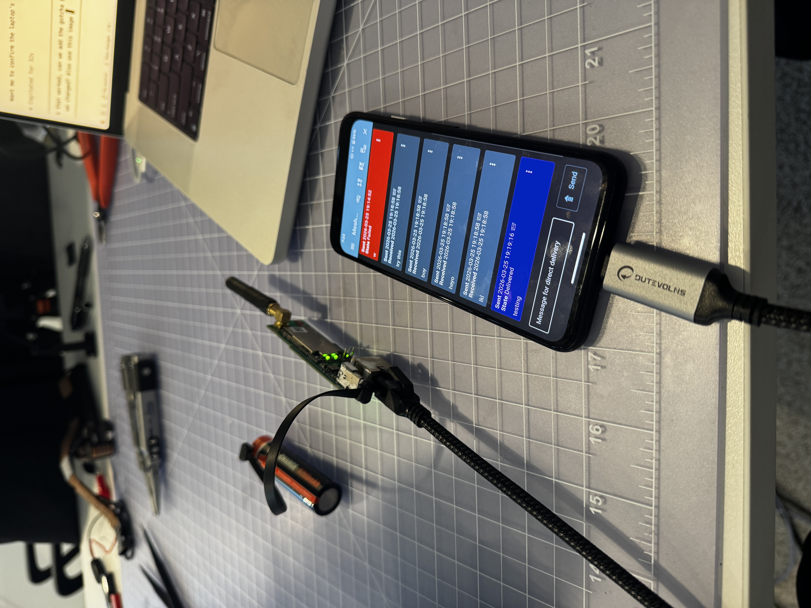

# Reticulum on Haven Mesh Networks

[Reticulum](https://reticulum.network/) is a cryptography-based stack for end-to-end encrypted links over any packet network.

> [!TIP]
> **The usual, easiest way:** **do not install Reticulum (RNS) on your Haven nodes** at all. **Run Reticulum only on your own devices** — e.g. [Sideband](https://github.com/markqvist/Sideband) (phone), [MeshChat](https://github.com/liamcottle/reticulum-meshchat) (desktop), or [NomadNet](https://github.com/markqvist/NomadNet). Connect each device to the **Haven WiFi**; it gets a `10.41.x.x` address. In the app, enable **AutoInterface**. Haven’s mesh is just IP under the covers — the HaLow backhaul is invisible, and your apps discover each other on the same subnet. **No RNS on the node, no SSH, no `setup-reticulum.sh` on the node.** Use the on-node path below only when you truly need it (ATAK/CoT bridge, always-on services on a node, or the demo scripts in this repo).

**[Haven Guide](https://buildwithparallel.com/products/haven)** - Video tutorials and support for the complete Haven platform.

## Why Reticulum?

- **End-to-end encryption** - All traffic is encrypted by default
- **Transport agnostic** - Works over WiFi, LoRa, serial, or any packet-based medium
- **No central infrastructure** - Fully decentralized, works offline
- **Small footprint** - Runs on resource-constrained devices
- **Future-proof** - Can integrate LoRa RNodes for extreme range

## Deployment Approaches

This section matches the [setup guide: Step 3](../../docs/getting-started/setup-guide.md#step-3-install-reticulum-optional) — start here before running anything on nodes.

---

### Recommended: Reticulum on your devices only (no RNS on Haven)

**This is what we suggest for most people:** keep Haven nodes as **normal mesh routers** (OpenMANET, BATMAN-adv, `br-ahwlan`). **Do not install** `rnsd` / RNS on the Pi. Install **Sideband, MeshChat,** or another Reticulum app on each **laptop, tablet, or phone**; connect to the gate or point **WiFi**; enable **AutoInterface** in the app. Reticulum traffic runs **client-to-client** over the `10.41.x.x` LAN that Haven already provides.

The mesh nodes act as pure IP routers. Each end-user device runs a Reticulum **client** and uses the haven network like any other WiFi — the HaLow transport is completely invisible to them.

```
┌─────────────┐        ┌─────────────────────────────────┐        ┌─────────────┐
│   Laptop    │        │         Haven Mesh              │        │   Phone     │
│  MeshChat   │──WiFi──│  gate ──(HaLow)── heltec node  │──WiFi──│  Sideband   │
│  RNS stack  │        │   (no RNS needed on nodes)      │        │  RNS stack  │
└─────────────┘        └─────────────────────────────────┘        └─────────────┘
         │                                                                │
         └──────────── same 10.41.x.x subnet ─────────────────────────────┘
                       RNS AutoInterface discovers peers via multicast
```

**How it works:**
- Laptop connects to the gate's WiFi AP → gets a `10.41.x.x` IP
- Phone connects to a heltec node's bridged WiFi AP → also gets a `10.41.x.x` IP
- Both are on the same mesh subnet — IP packets route between them over HaLow transparently
- Reticulum's AutoInterface uses UDP multicast to discover peers on the subnet automatically
- No RNS config, no node SSH access, no installation on mesh nodes required

**Supported apps:**
| App | Platform | Use case |
|-----|----------|----------|
| [Sideband](https://github.com/markqvist/Sideband) | iOS, Android | Encrypted messaging, location sharing |
| [MeshChat](https://github.com/liamcottle/reticulum-meshchat) | Desktop (macOS, Windows, Linux) | Group chat, file transfer |
| [NomadNet](https://github.com/markqvist/NomadNet) | Desktop | Pages, message boards |

**Setup on each EUD:**
1. Install the Reticulum app (Sideband, MeshChat, etc.)
2. Connect the device to the Haven mesh WiFi
3. In the app's Reticulum config, enable `AutoInterface` — no other config needed
4. Devices discover each other automatically via multicast on the shared subnet

> The mesh handles the HaLow bridging under the hood — from Reticulum’s perspective it is just a Wi‑Fi (IP) network.

---

### Advanced: RNS running on a Haven node

**Only if you need it:** install RNS *on* a node. Typical reasons — **not** for basic Sideband/MeshChat use:

- **[ATAK/CoT bridge](../atak/README.md)** (bridge requires `rnsd` on the node)  
- **Always-on** RNS (NomadNet pages, LXMF stores) when no user device is on the mesh  
- This repo’s **[`rns_*.py`](../scripts/tools/)** demos, which SSH into `/root/…` on the node  

For **peer-to-peer messaging and apps on phones/laptops,** stay with **EUDs only** above; do **not** add RNS to Haven unless one of the above applies.

Installing RNS directly on the mesh nodes enables the extra capabilities on the **node**:
- **Transport node** — nodes can relay traffic between Reticulum segments (e.g. bridging HaLow mesh to a LoRa RNode for extreme range)
- **Always-on services** — run NomadNet pages or LXMF message stores that are available even when no laptops are connected
- **Cross-interface routing** — route between HaLow, LoRa, and internet-connected segments at the node level
- **Store-and-forward** — nodes buffer messages for offline EUDs

---

## Architecture (when RNS is installed on a node)

The diagram is for **rnsd on the node** (advanced). **Client-only** deployments still use the same `br-ahwlan` and `10.41.x.x` path from the radio up — the Reticulum process just runs on your **phone or laptop** instead of on the Pi.

```
┌─────────────────────────────────────────────────────────────┐
│                    Application Layer                        │
│         (ATAK, Sideband, LXMF, Custom Apps)                │
├─────────────────────────────────────────────────────────────┤
│                    Reticulum Stack                          │
│    ┌──────────────┐  ┌──────────────┐  ┌──────────────┐    │
│    │ AutoInterface│  │ UDPInterface │  │ TCPInterface │    │
│    │ (br-ahwlan)  │  │ (broadcast)  │  │  (clients)   │    │
│    └──────────────┘  └──────────────┘  └──────────────┘    │
├─────────────────────────────────────────────────────────────┤
│                    Network Layer                            │
│              br-ahwlan (Linux Bridge)                       │
│    ┌──────────────┐  ┌──────────────┐  ┌──────────────┐    │
│    │   bat0       │  │   wlan0      │  │   phy1-ap0   │    │
│    │ (BATMAN-adv) │  │  (HaLow)     │  │   (5GHz)     │    │
│    └──────────────┘  └──────────────┘  └──────────────┘    │
├─────────────────────────────────────────────────────────────┤
│                    Physical Layer                           │
│         HaLow 916 MHz          5GHz/2.4GHz WiFi            │
└─────────────────────────────────────────────────────────────┘
```

## Installing RNS on a Haven node (advanced)

Stock OpenMANET does **not** have to run Reticulum. Use the optional [setup script](../../scripts/optional/setup-reticulum.sh) (see the [setup guide, Step 3](../../docs/getting-started/setup-guide.md#step-3-install-reticulum-optional) **on-node** subsection) only when you need `rnsd` on the device.

To install manually (e.g. for debugging or a custom build):

```bash
# Install Python and pip
opkg update
opkg install python3 python3-pip

# Install Reticulum
pip3 install rns
```

## Configuration (on-node RNS)

The following applies to **`rnsd` on a node**, not to Sideband/MeshChat on your laptop.

The Reticulum configuration file is located at `/root/.reticulum/config` on each node. Edit it to control which network interface Reticulum uses.

```bash
vi /root/.reticulum/config
```

Reticulum is **radio-agnostic**. It doesn't know or care what radio is underneath — it just needs a Linux network interface to bind to. You give it a device name (a bridge, an ethernet adapter, a WiFi interface) and Reticulum uses multicast to auto-discover other nodes on that interface. That's it.

There is nothing HaLow-specific in the Reticulum config. The interface name `[[HaLow Mesh Bridge]]` is just a human-readable label — you could call it `[[My Cool Interface]]` and it would work the same. The `type = AutoInterface` tells Reticulum to use multicast discovery, and `devices = br-ahwlan` tells it which Linux network device to use. Reticulum has no idea what radio is on the other end of that device.

### How HaLow Gets to Reticulum

On Haven nodes, the HaLow radio goes through several layers before Reticulum sees it:

```
HaLow radio (wlan0)  →  BATMAN mesh (bat0)  →  Linux bridge (br-ahwlan)  →  Reticulum
```

- **wlan0** — the physical HaLow 916 MHz radio
- **bat0** — BATMAN-adv mesh routing layer on top of wlan0
- **br-ahwlan** — a Linux bridge containing bat0, defined in OpenWrt's `/etc/config/network`

Reticulum only sees `br-ahwlan`. It sends multicast packets on that bridge, and they happen to travel over HaLow because that's what's bridged in. If you replaced the HaLow radio with a LoRa adapter or an ethernet cable and bridged it into `br-ahwlan`, Reticulum would work without any config change.

### Default Config (same on all nodes)

```ini
[reticulum]
  share_instance = Yes
  enable_transport = Yes
  instance_control_port = 37428

[interfaces]
  # The name in double brackets is just a label — call it anything
  [[HaLow Mesh Bridge]]
    type = AutoInterface        # Use multicast to find peers
    enabled = Yes
    devices = br-ahwlan         # Linux network device to bind to
    group_id = reticulum

  [[UDP Broadcast]]
    type = UDPInterface
    enabled = Yes
    listen_ip = 0.0.0.0
    listen_port = 4242
    forward_ip = 10.41.255.255
    forward_port = 4242
```

> **Note:** The config is identical on green (gate) and blue (point) nodes. Using `listen_ip = 0.0.0.0` binds to all interfaces, so the config works regardless of which IP openmanetd assigns.

### Using a Different Radio

To run Reticulum over a different radio, just change `devices` to that radio's Linux network interface:

| Radio | Interface | Config |
|-------|-----------|--------|
| HaLow (default) | `br-ahwlan` | `devices = br-ahwlan` |
| Standard WiFi | `wlan1` | `devices = wlan1` |
| Ethernet | `eth0` | `devices = eth0` |

After editing, restart Reticulum:

```bash
/etc/init.d/rnsd restart
```

### Interface Types Explained

| Interface | Purpose |
|-----------|---------|
| AutoInterface | Auto-discovers peers on a network device via multicast — radio-agnostic |
| UDPInterface | Broadcasts packets to all nodes on the mesh subnet |

## Running Reticulum on a node

### As a service (`rnsd`)
```bash
# Start
/etc/init.d/rnsd start

# Enable at boot
/etc/init.d/rnsd enable

# Check status
python3 /root/rns_status.py
```

### Manually
```bash
rnsd &
```

## On-node tools and monitoring

**Requires** RNS installed and running on the **node** (e.g. after [setup-reticulum](../../scripts/optional/setup-reticulum.sh)). For day-to-day messaging with Sideband/MeshChat, you do **not** need any of this.

### Live Dashboard (rns_status.py)

A live-refreshing dashboard that shows Reticulum status, HaLow radio details, configured interfaces, and real-time data exchange between nodes. See [`scripts/tools/rns_status.py`](../scripts/tools/rns_status.py) for the full script.

```bash
# Standalone — shows status and waits for peers
python3 /root/rns_status.py

# Connect to a peer — enables live PING/PONG exchange
python3 /root/rns_status.py <peer_hash>
```

The dashboard displays:
- Reticulum version, node hash, and link status
- HaLow radio: hardware, frequency, channel, bit rate, signal strength, encryption
- Configured Reticulum interfaces (AutoInterface, UDPInterface, etc.)
- Live packet TX/RX counters and per-peer RTT

### Message Transfer Demo

Simple sender/receiver scripts for testing Reticulum links across the mesh. See [`scripts/tools/rns_send.py`](../scripts/tools/rns_send.py) and [`scripts/tools/rns_receive.py`](../scripts/tools/rns_receive.py).

```bash
# Receiver — prints destination hash, then waits
python3 /root/rns_receive.py

# Sender — resolves path, establishes link, sends message
python3 /root/rns_send.py <dest_hash> Your message here
```

### View Paths
```bash
rnpath -l
```

## Data flow (ATAK bridge; requires on-node RNS)

When an ATAK device sends a CoT message, on nodes that run the **CoT bridge** and `rnsd`:

```
1. ATAK sends CoT XML to multicast (SA: 239.2.3.1:6969, Chat: 224.10.10.1:17012)
2. CoT Bridge intercepts multicast, compresses with zlib
3. Bridge fragments if compressed size > 400 bytes
4. Bridge sends over encrypted Reticulum link
5. Reticulum encrypts and transmits via AutoInterface over HaLow mesh
6. Remote node's Reticulum receives and decrypts
7. Remote CoT Bridge reassembles fragments, decompresses
8. Bridge re-publishes to local multicast groups
9. Remote ATAK devices receive CoT data
```

No special ATAK configuration is needed — devices use their default multicast settings. The bridge transparently intercepts and relays traffic.

## MTU Considerations

Reticulum has a 500-byte packet MTU to support low-bandwidth links like LoRa. For larger ATAK messages:

- The bridge compresses data with zlib (typically 1-38% reduction for CoT XML)
- Messages exceeding 400 bytes after compression are fragmented and reassembled
- SA beacons (~300-340 bytes) typically fit in a single packet
- Chat messages (~700-800 bytes) usually require 2 fragments
- Fragmentation adds ~20ms latency per fragment

## Troubleshooting

### Android via Ethernet (USB-C Adapter) Can't Reach Peers



Android does not reliably join multicast groups on USB-C Ethernet adapters, so Reticulum's AutoInterface peer discovery never fires — even when the phone has a valid `10.41.x.x` IP and WiFi is off.

**Fix:** Use a direct TCP connection instead of AutoInterface multicast.

On the device running MeshChat (or any Reticulum app acting as a hub), add a TCP server interface to its Reticulum config:

```ini
[[TCP Server]]
  type = TCPServerInterface
  enabled = Yes
  listen_ip = 0.0.0.0
  listen_port = 4965
```

On Sideband (Android), open Settings → Reticulum Config and add:

```ini
[[TCP to MeshChat]]
  type = TCPClientInterface
  enabled = Yes
  target_host = 10.41.0.x   # IP of the device running MeshChat
  target_port = 4965
```

Restart both apps. The phone connects directly over TCP — no multicast needed.

> **Note:** The Heltec's Ethernet port is bridged into `br-ahwlan` by `configure-heltec.sh`, so wired clients get a `10.41.x.x` address and are on the same subnet as WiFi clients. The TCP workaround is only needed because Android suppresses multicast on USB Ethernet interfaces — the underlying IP routing is fine.

### No Peers Visible
```bash
# Check interface is up
python3 /root/rns_status.py

# Verify bridge interface exists
ip link show br-ahwlan

# Check multicast is working
tcpdump -i br-ahwlan udp port 4242
```

### High Latency
- Check HaLow signal strength: `iwinfo wlan0 info`
- Verify no packet loss: `ping -c 100 $(uci get network.ahwlan.gateway)`
- Large messages require fragmentation - this adds latency

### Reticulum Won't Start
```bash
# Check for errors
rnsd -v

# Verify config syntax
python3 -c "import RNS; RNS.Reticulum()"
```

## Future Enhancements

- **LoRa Integration**: Add RNode interface for extreme-range backup
- **Sideband Messaging**: Direct encrypted messaging via Reticulum
- **LXMF**: Store-and-forward messaging for offline nodes
