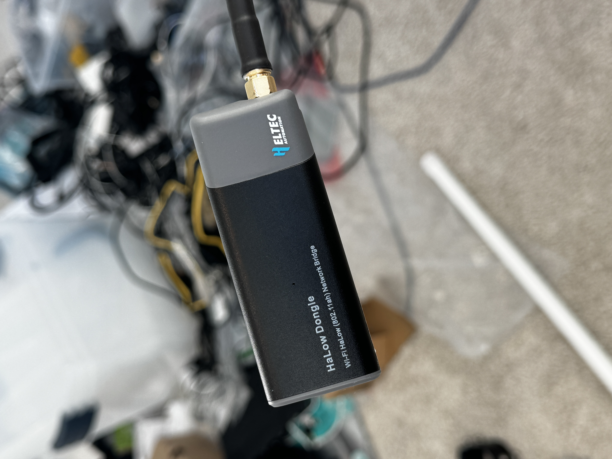

# Haven Setup Scripts

Automated setup scripts for configuring Haven mesh nodes.

**Full Haven Guide**: [buildwithparallel.com/products/haven](https://buildwithparallel.com/products/haven) - includes videos, schematics, 3D printable enclosures, Discord community, and direct support.

> **Prerequisite:** All scripts assume each node is flashed with a fresh/recent version of [OpenMANET](https://openmanet.org/).
>
> **Fresh install:** Flash OpenMANET onto each node's microSD card using Raspberry Pi Imager, then insert the card and power on.
>
> **Upgrading an existing install:** Open LuCI → System → Backup / Flash Firmware → upload the OpenMANET image. **Uncheck "Keep settings"** for a clean slate.

## Scripts Overview

| Script | Purpose | Run On |
|--------|---------|--------|
| `setup-haven-gate.sh` | Configure gateway node (internet uplink) | First node |
| `setup-haven-point.sh` | Configure extender node | Additional nodes |
| `setup-reticulum.sh` | Install encrypted mesh overlay | Any node (optional) |
| `configure-heltec.sh` | Configure Heltec HaLow node for BATMAN-adv mesh | Heltec v2 nodes |
| `haven-bridge-check.sh` | Boot-time health check — auto-repairs BATMAN bridge | All mesh nodes |
| `setup-cot-bridge.sh` | Install ATAK/CivTAK bridge | Any node (optional) |
| `rns_status.py` | Live Reticulum + HaLow network dashboard | Any node |
| `rns_send.py` | Send a message over Reticulum | Sender node |
| `rns_receive.py` | Receive messages over Reticulum | Receiver node |

## Step 1: Set Up the Gate Node (green)

This is the node that shares internet with the rest of the mesh.

1. Plug the gate node into your **upstream router via Ethernet**
2. Find the gate's IP address in your **router's device list**
3. Open a terminal on the gate — pick one:
   - **SSH:** `ssh root@<gate-ip>` from your computer
   - **Browser:** go to `http://<gate-ip>` → **Services → Terminal**
4. Run the setup script:
```bash
wget -O setup.sh https://raw.githubusercontent.com/buildwithparallel/haven-manet-ip-mesh-radio/main/scripts/setup-haven-gate.sh
sh setup.sh && reboot
```
5. Wait ~60 seconds for reboot

## Step 2: Add Point Nodes (blue)

Point nodes extend the mesh — no internet connection needed.

1. Plug Ethernet **directly from your computer to the point node**
2. Open a browser and go to `http://10.41.254.1`
3. Go to **Services → Terminal**
4. The point node has no internet, so you'll need to paste the script:
   - On your computer, open the [raw setup script](https://raw.githubusercontent.com/buildwithparallel/haven-manet-ip-mesh-radio/main/scripts/setup-haven-point.sh) in a browser tab
   - Select all and copy
   - Paste into the point node's terminal and press Enter
5. After the script finishes, type `reboot` and press Enter
6. Wait ~60 seconds for reboot

### Adding More Nodes

For each additional point node:
1. Edit `setup-haven-point.sh` with unique `HOSTNAME` and `MESH_IP`
2. Keep `MESH_ID`, `MESH_KEY`, `HALOW_CHANNEL` the same as gate
3. Run script and reboot

### Verify the Mesh

1. Connect to **green-5ghz** WiFi (password: `green-5ghz`)
2. Find the point node's mesh IP (run `uci get network.ahwlan.ipaddr` on the point node, or check its boot screen)
3. Browse to **http://\<point-mesh-ip\>** — if blue's LuCI loads, your mesh is working

```bash
iwinfo wlan0 info     # HaLow link quality
batctl n              # BATMAN-adv neighbors
ping <gate-mesh-ip>   # Ping gateway (find with: uci get network.ahwlan.ipaddr on the gate)
```


> After setup, use LuCI's web interface to change passwords, WiFi SSIDs, and other settings on each node. See [Accessing the Web Interface](#accessing-the-web-interface-luci) below.

### Connect Your Device

After setup, connect your computer, phone, or tablet to the Haven network:

1. **Join the node's WiFi** — look for `green-5ghz` or `blue-5ghz` in your WiFi list
   - Gate WiFi password: `green-5ghz`
   - Point WiFi password: `blue-5ghz`
2. **Verify your device got an IP** — you should receive an address in the `10.41.x.x` range
   - **Mac/Linux:** `ifconfig` or `ip addr` — look for `10.41.x.x` on your WiFi interface
   - **Windows:** `ipconfig` — look for `10.41.x.x` under your Wi-Fi adapter
   - **Phone:** Settings → WiFi → tap the connected network to see your IP
3. **Access the node's web interface** — browse to `http://<node-mesh-ip>`
   - Find the mesh IP by running `uci get network.ahwlan.ipaddr` on the node, or check its boot screen

> **Can't see the WiFi network?** See [Troubleshooting → Can't Connect from Computer or Phone](#cant-connect-from-computer-or-phone).
>
> **Alternative:** If the gate node is plugged into your home router, you can also connect your computer to your **regular home WiFi** and access the gate at the IP shown in your router's device list — no need to switch WiFi networks.

## Step 3: Install Reticulum (Optional)

Adds an encrypted communications overlay to the mesh. Run on **each node** that needs Reticulum:

```bash
wget -O /tmp/setup-reticulum.sh https://raw.githubusercontent.com/buildwithparallel/haven-manet-ip-mesh-radio/main/scripts/setup-reticulum.sh
sh /tmp/setup-reticulum.sh
/etc/init.d/rnsd enable && /etc/init.d/rnsd start
```

See [Reticulum/README.md](../Reticulum/README.md) for configuration details, interface types, and how HaLow traffic reaches Reticulum.

## Step 4: Send Reticulum Messages (Optional)

Three scripts for demonstrating and monitoring Reticulum data transfer over the Haven mesh. Requires [Step 3](#step-3-install-reticulum-optional).

### rns_status.py — Live Network Dashboard

A live-refreshing dashboard showing Reticulum network status, HaLow radio details, configured interfaces, and real-time data exchange with PING/PONG between nodes. Refreshes every 3 seconds.

**Deploy to a node:**
```bash
scp scripts/rns_status.py root@<node_ip>:/root/rns_status.py
```

**Usage:**
```bash
# Standalone mode (listen only, no outbound link)
python3 /root/rns_status.py

# Peered mode (connect to another node running rns_status.py)
python3 /root/rns_status.py <peer_destination_hash>
```

**Two-node setup:**
1. Start on the first node (BLUE) with no arguments — note the destination hash it prints
2. Start on the second node (GREEN) with BLUE's hash — it connects and begins exchanging PING/PONG

```bash
# On BLUE (listener)
python3 /root/rns_status.py

# On GREEN (initiator) — use BLUE's hash from step 1
python3 /root/rns_status.py b9b2bef4bf0510882bcd394469c20928
```

**Example output — standalone (before peering):**
```
  Reticulum Network Status — green
  ======================================================
  Version         : RNS 0.9.3
  Node hash       : ca6fafa5fe557c2f1a86807ee129671c
  Status          : Waiting for peers...

  Radio Transport Layer
  ------------------------------------------------------
    Hardware      : Morse Micro MM6108 802.11ah (HaLow)
    Mode          : Mesh Point
    Mesh ID       : haven
    Frequency     : 916.0 MHz
    Channel       : 28
    Bit Rate      : 32.5 MBit/s
    Signal        : -6 dBm
    Encryption    : WPA3 SAE (CCMP)

  Reticulum Interfaces
  ------------------------------------------------------
    [HaLow Mesh Bridge]
      Type        : AutoInterface
      Device      : br-ahwlan
    [UDP Broadcast]
      Type        : UDPInterface
      Listen      : 10.41.0.1:4242
      Forward     : 10.41.255.255:4242

  Data Exchange
  ------------------------------------------------------
    Packets TX    : 0
    Packets RX    : 0
    Peers         : Discovering...

  ──────────────────────────────────────────────────────
  Refreshing every 3s — Ctrl+C to exit
```

**Example output — linked (active data exchange):**
```
  Reticulum Network Status — green
  ======================================================
  Version         : RNS 0.9.3
  Node hash       : ca6fafa5fe557c2f1a86807ee129671c
  Status          : Linked with blue

  Radio Transport Layer
  ------------------------------------------------------
    Hardware      : Morse Micro MM6108 802.11ah (HaLow)
    Mode          : Mesh Point
    Mesh ID       : haven
    Frequency     : 916.0 MHz
    Channel       : 28
    Bit Rate      : 32.5 MBit/s
    Signal        : -6 dBm
    Encryption    : WPA3 SAE (CCMP)

  Reticulum Interfaces
  ------------------------------------------------------
    [HaLow Mesh Bridge]
      Type        : AutoInterface
      Device      : br-ahwlan
    [UDP Broadcast]
      Type        : UDPInterface
      Listen      : 10.41.0.1:4242
      Forward     : 10.41.255.255:4242

  Data Exchange
  ------------------------------------------------------
    Packets TX    : 42
    Packets RX    : 43
    Peer [blue]   : RTT 23.4ms  (alive)

  ──────────────────────────────────────────────────────
  Refreshing every 3s — Ctrl+C to exit
```

### rns_send.py / rns_receive.py — Message Transfer Demo

Simple sender/receiver pair for demonstrating Reticulum message delivery across the mesh.

**Deploy to nodes:**
```bash
scp scripts/rns_receive.py root@<receiver_ip>:/root/rns_receive.py
scp scripts/rns_send.py root@<sender_ip>:/root/rns_send.py
```

**Usage:**
```bash
# On the receiver node — note the destination hash
python3 /root/rns_receive.py

# On the sender node — use the receiver's hash
python3 /root/rns_send.py <dest_hash> Hello from GREEN over Reticulum and HaLow
```

**Example — receiver:**
```
Listening...
Destination hash: a1b2c3d4e5f6a7b8c9d0e1f2a3b4c5d6
Link established!

>>> Hello from GREEN over Reticulum and HaLow
```

**Example — sender:**
```
Resolving path...
Connecting...
Sending: Hello from GREEN over Reticulum and HaLow
Sent!
```

## Step 5: Install the ATAK Bridge (Optional)

Bridges ATAK/CivTAK situational awareness traffic over Reticulum. Requires [Step 3](#step-3-install-reticulum-optional).

```bash
wget -O /tmp/setup-cot-bridge.sh https://raw.githubusercontent.com/buildwithparallel/haven-manet-ip-mesh-radio/main/scripts/setup-cot-bridge.sh
sh /tmp/setup-cot-bridge.sh
/etc/init.d/cot_bridge enable && /etc/init.d/cot_bridge start
```

See [ATAK/README.md](../ATAK/README.md) for peering, live dashboards, and troubleshooting.

### Verify ATAK Bridge
```bash
tail -f /tmp/bridge.log
```

## Configuring Heltec HaLow Nodes (BATMAN-adv)

The `configure-heltec.sh` script sets up [Heltec HaLow](https://heltec.org/project/ht-hd01/) nodes running OpenWrt to join the Haven mesh using BATMAN-adv routing over 802.11s.



This is an alternative to the standard point node setup — use it when your node is a Heltec v2 HaLow board rather than a Raspberry Pi with a HaLow HAT.

**What it does:**

1. Binds the HaLow mesh radio to `bat0` via a `batadv_hardif` interface
2. Disables 802.11s forwarding (BATMAN-adv handles routing instead)
3. Creates `bat0` with BATMAN_V in client gateway mode
4. Bridges `bat0` into `br-ahwlan` with a static mesh IP
5. Connects the local WiFi AP to the mesh bridge so clients get internet
6. Removes conflicting anonymous bridge devices from the default firmware

**Usage:**

1. SSH into the Heltec node: `ssh root@10.42.0.1`
2. Edit the configuration variables at the top of the script (`HOSTNAME`, `MESH_IP`, etc.) for your node
3. Paste the script into the terminal and run it
4. Reboot: `reboot`

```bash
# Configuration variables to set per-node:
HOSTNAME="heltec-4"
MESH_IP="10.41.0.4"
MESH_NETMASK="255.255.0.0"
GATEWAY_IP="10.41.0.3"
```

After reboot, the node is reachable at `MESH_IP` on the mesh network.

> **Note:** The Heltec default firmware ships with an anonymous bridge device for `br-ahwlan` that conflicts with BATMAN-adv. The script automatically detects and removes these before creating the correct bridge configuration.

---

## Configuration Reference

### Gate Node Defaults (green)

| Setting | Default | Description |
|---------|---------|-------------|
| `HOSTNAME` | green | Node hostname |
| `ROOT_PASSWORD` | havengreen | SSH/LuCI password |
| `MESH_ID` | haven | Mesh network name |
| `MESH_KEY` | havenmesh | Mesh encryption key |
| `MESH_IP` | 10.41.0.1 | Initial node IP (openmanetd may reassign) |
| `HALOW_CHANNEL` | 27 | HaLow channel (914 MHz) |
| `HALOW_HTMODE` | HT20 | Channel width (2 MHz) |

### Point Node Defaults (blue)

| Setting | Default | Description |
|---------|---------|-------------|
| `HOSTNAME` | blue | Node hostname |
| `ROOT_PASSWORD` | havenblue | SSH/LuCI password |
| `MESH_IP` | 10.41.0.2 | Initial node IP (openmanetd may reassign) |
| `GATEWAY_IP` | 10.41.0.1 | Initial gate node IP (openmanetd may reassign) |

> **Note:** OpenMANET's address reservation system manages mesh IPs on all nodes after setup. The defaults above are initial values — the final IPs may differ. Run `uci get network.ahwlan.ipaddr` on any node to find its current mesh IP, or check the boot screen on a connected monitor. To discover the IPs of all mesh nodes from any node, run:
> ```
> strings /etc/openmanetd/openmanetd.db | grep -E 'green|blue'
> ```
> This prints each node's MAC address, hostname, and current mesh IP.

### HaLow Channel Selection

| Region | Frequency Range | Example |
|--------|-----------------|---------|
| US/FCC | 902-928 MHz | Channel 28 = 916 MHz |
| EU/ETSI | 863-868 MHz | Region-specific |
| Japan | 920-928 MHz | Region-specific |
| Australia | 915-928 MHz | Region-specific |

### Channel Width vs Range

Max PHY rate depends on the HaLow SoC. Haven ships with the **MM6108** (MCS 0–7, up to 64-QAM). The **MM8108** is a drop-in upgrade adding MCS 8–9 (256-QAM) for higher peak rates and an integrated 26 dBm PA.

| Setting | Width | MM6108 Max | MM8108 Max | Range |
|---------|-------|------------|------------|-------|
| HT10 | 1 MHz | 3.3 Mbps | 4.4 Mbps | Maximum |
| HT20 | 2 MHz | 7.2 Mbps | 8.7 Mbps | Very Long |
| HT40 | 4 MHz | 15.0 Mbps | 20.0 Mbps | Long |
| HT80 | 8 MHz | 32.5 Mbps | 43.3 Mbps | Medium |

> Real-world throughput is typically 40–60% of PHY rate depending on signal, interference, and distance.

<details>
<summary>Full 802.11ah MCS reference table</summary>

All rates are single-stream PHY rates in Mbps.

| MCS | Modulation | Coding | 1 MHz | 2 MHz | 4 MHz | 8 MHz |
|-----|------------|--------|------:|------:|------:|------:|
| 10 | BPSK | 1/2 x2 | 0.17 | — | — | — |
| 0 | BPSK | 1/2 | 0.33 | 0.72 | 1.50 | 3.25 |
| 1 | QPSK | 1/2 | 0.67 | 1.44 | 3.00 | 6.50 |
| 2 | QPSK | 3/4 | 1.00 | 2.17 | 4.50 | 9.75 |
| 3 | 16-QAM | 1/2 | 1.33 | 2.89 | 6.00 | 13.00 |
| 4 | 16-QAM | 3/4 | 2.00 | 4.33 | 9.00 | 19.50 |
| 5 | 64-QAM | 2/3 | 2.67 | 5.78 | 12.00 | 26.00 |
| 6 | 64-QAM | 3/4 | 3.00 | 6.50 | 13.50 | 29.25 |
| 7 | 64-QAM | 5/6 | 3.33 | 7.22 | 15.00 | 32.50 |
| 8 | 256-QAM | 3/4 | 4.00 | 8.67 | 18.00 | 39.00 |
| 9 | 256-QAM | 5/6 | 4.44 | — | 20.00 | 43.33 |

MCS 0–7 and 10: supported by both MM6108 and MM8108.
MCS 8–9 (256-QAM): **MM8108 only**.

**Receiver sensitivity** (MM8108, 10% PER, 256-byte packets):

| MCS | 1 MHz | 2 MHz | 4 MHz | 8 MHz |
|-----|------:|------:|------:|------:|
| 0 | -106 dBm | -103 dBm | -102 dBm | -98 dBm |
| 7 | -89 dBm | -86 dBm | -83 dBm | -80 dBm |
| 9 | -83 dBm | — | -78 dBm | -74 dBm |

**Max TX power** (MM8108, at module antenna pin):

| MCS | 1 MHz | 2 MHz | 4 MHz | 8 MHz |
|-----|------:|------:|------:|------:|
| 0 | 25.5 dBm | 25.0 dBm | 22.5 dBm | 22.5 dBm |
| 7 | 19.0 dBm | 20.0 dBm | 19.5 dBm | 20.0 dBm |
| 9 | 15.5 dBm | — | 17.0 dBm | 16.0 dBm |

</details>

## Accessing the Web Interface (LuCI)

After setup and reboot, you can manage each node through its web interface.

> **Finding mesh IPs:** OpenMANET dynamically assigns mesh IPs on all nodes. Run `uci get network.ahwlan.ipaddr` on any node to find its current IP, or check the boot screen on a connected monitor.

#### Finding Node IPs from the Gate

SSH into the gate and use the method that matches your node type:

**OpenMANET nodes** (gate, point — running OpenMANET firmware):
```bash
strings /etc/openmanetd/openmanetd.db | grep -E 'green|blue'
```
Returns each node's MAC, hostname, and mesh IP:
```
2c:c6:82:8a:2a:f6 blue 10.41.126.198
```

**OpenWrt nodes** (Heltec HaLow — not in the OpenMANET database):
```bash
# DHCP leases — shows all devices that received an IP from the gate
cat /tmp/dhcp.leases

# ARP neighbors — shows all IPs reachable on the mesh bridge
ip neigh show dev br-ahwlan

# BATMAN translation table — shows all MACs reachable via mesh
batctl tg
```

**Gate Node (green)** — default password: `havengreen`

| Method | Steps |
|--------|-------|
| Gate WiFi | Connect to **green-5ghz** (password: `green-5ghz`), browse to **http://\<gate-mesh-ip\>** |
| Upstream network | Connect to your upstream router's WiFi, find the gate's IP in your router's device list, browse to that IP |

**Point Node (blue)** — default password: `havenblue`

| Method | Steps |
|--------|-------|
| Point WiFi | Connect to **blue-5ghz** (password: `blue-5ghz`), browse to **http://\<point-mesh-ip\>** |
| Gate WiFi (via mesh) | Connect to **green-5ghz**, browse to **http://\<point-mesh-ip\>** |

> **Tip:** If you can reach the point node's LuCI through the gate node's WiFi, your mesh is working.

## Troubleshooting

See the [Haven Guide](https://buildwithparallel.com/products/haven) for video tutorials and Discord support.

### Can't Connect from Computer or Phone

Your device connects to the Haven node's WiFi AP, then talks to the mesh through it. If you can't connect or can't reach anything after connecting, work through these steps:

**1. WiFi network not visible**
- Verify the 5GHz AP is running on the node: `iwinfo phy1-ap0 info`
- If no output, restart WiFi: `wifi reload`
- Make sure your device supports 5GHz WiFi — some older devices only see 2.4GHz networks
- If you're close to the node and still don't see it, SSH in via Ethernet or your upstream router and check that the radio is enabled: `uci show wireless | grep disabled`

**2. WiFi connects but no IP address**
- The gate node runs the DHCP server for the whole mesh. If your device says "Connected, No Internet" or doesn't get an IP:
  - Verify DHCP is running on the gate: `logread | grep dnsmasq`
  - Check DHCP leases: `cat /tmp/dhcp.leases`
  - Try forgetting the network on your device, then reconnecting
  - On the gate node, restart DHCP: `/etc/init.d/dnsmasq restart`

**3. Got an IP but can't reach the node's web interface**
- Confirm your device has a `10.41.x.x` address (see [Connect Your Device](#connect-your-device) above)
- If your IP is **not** in the `10.41.x.x` range, your device may have connected to a different network — check you joined `green-5ghz` or `blue-5ghz`, not your home WiFi
- Find the node's mesh IP: `uci get network.ahwlan.ipaddr` (run on the node via SSH or connected monitor)
- Test with ping from your device: `ping <node-mesh-ip>`
- If ping works but the browser doesn't load, try `http://<node-mesh-ip>` (not https)

**4. Connecting via your upstream/home network instead**
- If the gate is plugged into your home router, you don't need to switch WiFi — stay on your regular home network
- Find the gate's IP in your router's device list (look for a device named "green")
- Browse to `http://<that-ip>` — this reaches the gate's management interface via Ethernet, bypassing WiFi entirely

### Nodes Can't Connect
- Verify `MESH_ID`, `MESH_KEY`, `HALOW_CHANNEL` match exactly on all nodes
- Check HaLow radio: `iwinfo wlan0 info`

### No Internet on Point/Heltec Nodes

WiFi clients connect to a node's AP but have no internet. This is almost always a BATMAN-adv bridge issue on one of the nodes. Work through these steps **in order** — SSH into each node and check.

#### Quick diagnosis from any node

```bash
# 1. Can you reach the gate?
ping -c 2 10.41.0.3

# 2. Can the gate reach the internet?
# (SSH to gate first: ssh root@192.168.0.66)
ping -c 2 8.8.8.8

# 3. Is BATMAN seeing neighbors?
batctl n

# 4. Is bat0 in the bridge?
ip link show bat0        # look for "master br-ahwlan"

# 5. Does br-ahwlan have an IP?
ip addr show br-ahwlan   # should show 10.41.x.x
```

If any of those fail, follow the fix steps below.

#### Fix 1: Run the health check (fastest)

The `haven-bridge-check.sh` init script checks and auto-repairs the three most common failures. Run it on the broken node:

```bash
sh /etc/init.d/haven-bridge-check
```

It will report what it finds and fix:
- `bat0` missing from `br-ahwlan` bridge
- Mesh radio pointing to `ahwlan` instead of `batmesh`
- Missing `batmesh` hardif interface

If it says "All checks passed" but internet still doesn't work, continue to Fix 2.

#### Fix 2: Manual bridge repair

If the health check didn't fix it, do it manually:

```bash
# Check if bat0 is in the bridge
ip link show bat0
# Should say: master br-ahwlan
# If it says: master bat0 — that's wrong, wlan0 is going direct

# Check what the mesh radio points to
uci show wireless | grep network | grep mesh
# Should be: network='batmesh'
# If it says: network='ahwlan' — that's the problem

# Fix it:
uci set wireless.<mesh_iface>.network='batmesh'
uci set wireless.<mesh_iface>.mesh_fwding='0'
uci commit wireless

# Ensure batmesh hardif exists
uci set network.batmesh=interface
uci set network.batmesh.proto='batadv_hardif'
uci set network.batmesh.master='bat0'
uci commit network

# Restart
wifi down && service network restart && sleep 3 && wifi up

# Verify
batctl if          # should show: wlan0: active
ip link show bat0  # should show: master br-ahwlan
```

#### Fix 3: Anonymous bridge device conflict

OpenWrt can auto-create anonymous bridge devices that shadow the named one and leave `bat0` out of the bridge. This is the most common root cause.

```bash
# Check for anonymous devices
uci show network | grep '@device'
# If you see @device[N].name='br-ahwlan' — that's the conflict

# Remove all anonymous br-ahwlan devices
i=0
while uci get network.@device[$i] 2>/dev/null; do
    name=$(uci get network.@device[$i].name 2>/dev/null)
    if [ "$name" = "br-ahwlan" ]; then
        uci delete network.@device[$i]
        echo "Deleted anonymous device[$i]"
        continue
    fi
    i=$((i + 1))
done

# Recreate the named bridge device
uci set network.ahwlan_dev=device
uci set network.ahwlan_dev.name='br-ahwlan'
uci set network.ahwlan_dev.type='bridge'
uci delete network.ahwlan_dev.ports 2>/dev/null
uci add_list network.ahwlan_dev.ports='bat0'
uci commit network

service network restart
```

#### Fix 4: Gate-specific — check upstream internet

The gate forwards internet from `eth0` to the mesh. If the gate itself has no internet:

```bash
# On the gate:
ping -c 2 8.8.8.8               # upstream connectivity
ip route | grep default          # should go via eth0
ip addr show eth0                # should have upstream IP

# If eth0 lost its IP, restart networking:
service network restart

# Check NAT is enabled:
uci show firewall | grep masq    # should show masq='1'
```

#### Fix 5: Nuclear option — re-run setup

If nothing else works, re-run the setup script for the node type:
- **Gate:** `sh setup-haven-gate.sh && reboot`
- **Point:** `sh setup-haven-point.sh && reboot`
- **Heltec:** `sh configure-heltec.sh && reboot`

### Installing the Boot Health Check

The `haven-bridge-check.sh` script auto-repairs the mesh on every boot. Install it on each node:

```bash
# From your computer — install on the gate:
scp haven-bridge-check.sh root@<gate-ip>:/etc/init.d/haven-bridge-check
ssh root@<gate-ip> "chmod +x /etc/init.d/haven-bridge-check && /etc/init.d/haven-bridge-check enable"

# For Heltec/point nodes (via gate as jump host):
scp -o ProxyCommand="ssh -W %h:%p root@<gate-ip>" haven-bridge-check.sh root@<node-mesh-ip>:/etc/init.d/haven-bridge-check
ssh -o ProxyCommand="ssh -W %h:%p root@<gate-ip>" root@<node-mesh-ip> "chmod +x /etc/init.d/haven-bridge-check && /etc/init.d/haven-bridge-check enable"
```

Check the log after a reboot:
```bash
logread | grep haven-mesh
```

### Why Does the Bridge Break?

OpenWrt manages bridge devices in two ways:

1. **Anonymous `@device[N]`** — auto-created when `type='bridge'` is set on an interface, or when the `wifi` command regenerates config, or during firmware upgrades. These have no `ports` list.
2. **Named `ahwlan_dev`** — our explicit definition with `bat0` as a port.

When both exist, the anonymous one takes priority and `bat0` gets left out of the bridge. The mesh radio still works at layer 2 (BATMAN neighbors are visible) but there's no IP connectivity because `bat0` isn't bridged.

The setup scripts and boot health check prevent this by cleaning up anonymous devices and always re-asserting the correct named device.

### Reticulum Issues
- Check status: `python3 /root/rns_status.py`
- View logs: `rnsd -v`
